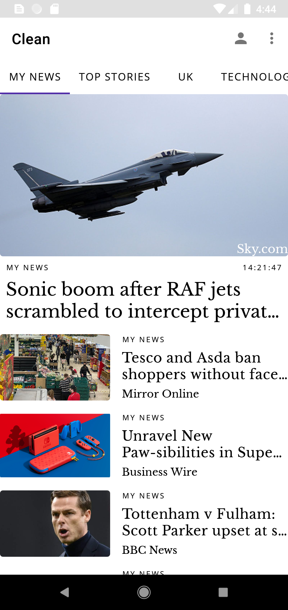
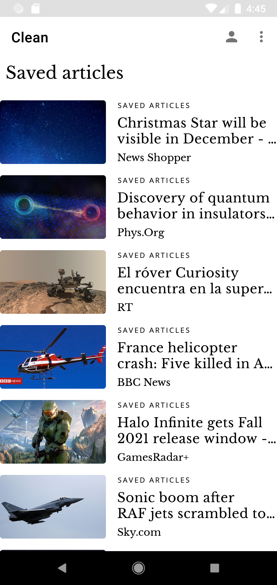
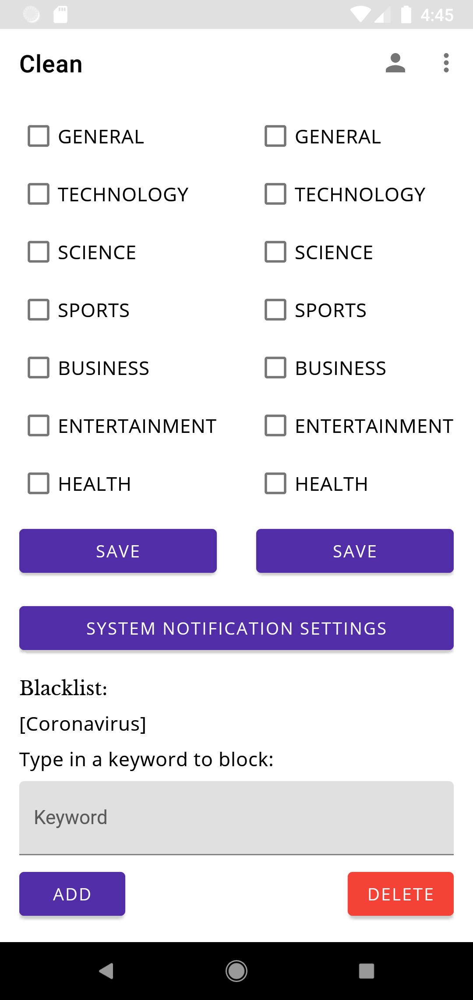

# Clean
> A modern Android news aggregator with an emphasis on a clean design.

## Table of contents
* [Introduction](#introduction)
* [Screenshots](#screenshots)
* [Features](#features)
* [Status](#status)
* [Contact](#contact)

## Introduction
Clean is a modern, minimal news aggregator built for Android. News articles from hundreds of sources and countless countries are available. Powered by news API and Kotlin.

## Screenshots

## Features
List of features:
* View articles from hundreds of sources and tens of countries
* Share or save articles to your library
* Control which news categories you see
* Blacklist certain words to prevent certain articles from being shown

## Status
Project is: _on hold_

## Contact
Created by [Chris Barker](https://github.com/barkerchris)